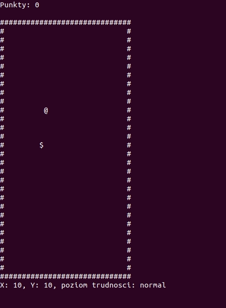

# Snake clone written in ANSI-C

This project was made a for C programming language course. It's pretty basic  ~~and it's only compatible with UNIX systems~~ (not since I added CMake). 

It's written in ANSI-C with a small help of the `ncurses` library to handle input and terminal rendering things.

# Build

To build the repo, make sure you have ncurses lib provided. CMake is also required. Then run `make`.

# Help

Run the app with `-h` switch to see available options. You can choose difficulty level or the size of game board.
